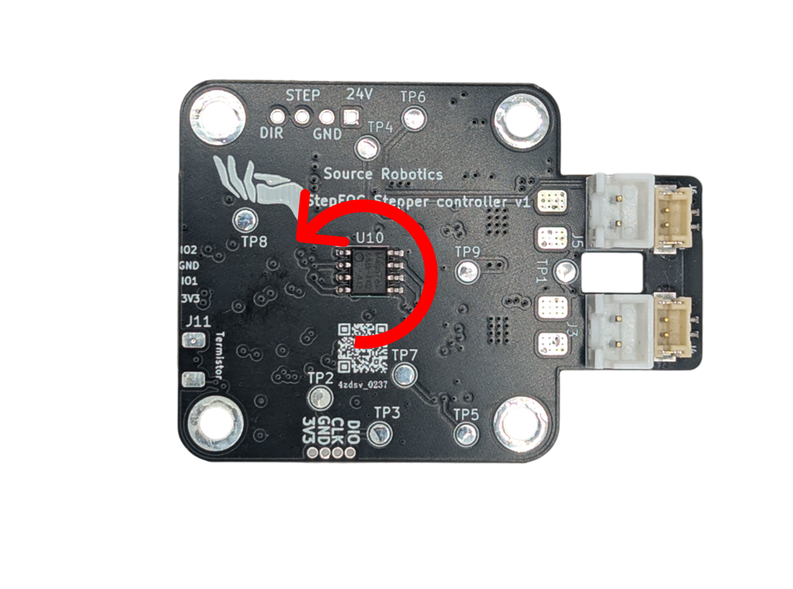
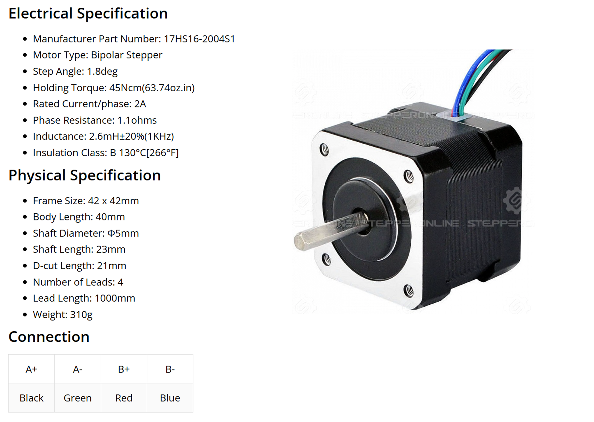

# **Calibration**

STEPFOC firmware has autocalibration feature that allows you to automatically detect and tune your motor parameters. It detects the following:

* Motor phase order
* Current loop PID parameters
* Motor Kt, KV
* Fine tune electrical angle

!!! Tip annotate "Vbus voltage" 
    When calibrating the motor use 24V supply voltage for the best results! 
    Using smaller voltage may result in incorrect Resistance, inductance and kt and other parameters!

!!! Note annotate "" 

## **Positive rotation**

!!! Tip annotate "In STEPFOC firmware positive rotation is always counter-clockwise. That means that positive current will result in rotation in that direction. Positive speed setpoint will rotate motor in that direction and rotating in that direction will increase motor positon!" 

    

!!! Note annotate "" 

## **Calibration settings**

**Note that the values that STEPFOC calculate are only estimations and if you want to get exact values use high precision insturments to measure them.**

!!! Note annotate "Resistance, Inductance and pole pair" 
    You will **NEED** to enter Resistance, Inductance and pole pair manually. STEPFOC will not calculate those for you and will return error if you dont change default values. Use #R, #L and #PP to enter the values listed in the spec sheet of your stepper motor!

!!! Danger annotate "Example motor" 

    

!!! Note annotate "" 

**For this motor we will use:**  
    #PP 50 
    #R 1.1 
    #L 0.0026 

For 1.8 deg stepper enter #PP 50  
For 1.2 deg stepper enter #PP 75  
For 0.9 deg stepper enter #PP 100  
For 0.72 deg stepper enter #PP 125  

!!! Note annotate "" 

## **Calling calibration routine**

Calibration routine can only be called from the UART interface. The command is: 

    #Cal

!!! Note annotate "" 

## **Calibration routine output**

!!! Note annotate "Note" 
    Values that our calibration routine returns here are specific to motor we tested. Your numbers WILL be different!

!!! Tip annotate "Tip" 
    In case your motor stays in one step of the calibration routine too long issues a **#Reset** command and try again. Also do that in case you dont get full log messages from the routine.

After calling calibration routine the following will happen:

    Calibration mode
    -----Settings-----

**Pole pair check** 
Make sure you enter correct pole pair for your stepper motor. Use this as a guide:

For 1.8 deg stepper enter #PP 50  
For 1.2 deg stepper enter #PP 75  
For 0.9 deg stepper enter #PP 100  
For 0.72 deg stepper enter #PP 125  

**Magnet and Vbus check** 
Motor will check Vbus voltage and try to  detect Encoder magnet. If both passed you will get:

    Magnet test: Passed
    Vbus test: Passed
!!! Danger annotate "Even if the magnet test "passed" your magnet could still be too far or to close (touching) the encoder IC. You need to make sure that distance between the magnet and the IC is around 1mm."

**Resistance and inductance measurement** 
Make sure you enter correct Resistance and Inductance of your stepper motor.
The output will be as follows:

    Resistance = 7.026575Ohm
    Inductance = 0.001492H
    Kp_iq = 1.288308
    Ki_iq = 0.630704

Motor will also calculate Kp_iq and Ki_iq using measured resistance, inductance and given current loop bandwidth. These values are really basic for stepper drivers and it is **best to manually tune them!**

**Open loop dir check** 
Motor will spin in one direction with open loop mode. If it spins in **positive direction** we continue if not it fails and you need to switch up motor phases.

**Phase order dir** 
Motor will start to spin in a single direction with voltage mode.
If it spins our phase connections are good. If it does not spin we need to switch them up and try again.

**Theta offset** 

Motor will spin rapidly in one direction and then switch to another. This can last few minutes (max 2 minutes after that it timeouts). 

**Kt, KV and flux linkage dir** 
Motor will start to spin fast in one direction for a short time. 
Good output will look like this (Your numbers will be different):

    KV is: 39.41667 
    Kt is: 0.20981
    Flux linkage is: 0.012716 

!!! Note annotate "Errors" 
    Note that in this step we measure motor KV and from that Kt and flux linkage. KV measurement can be wrong due the a lot of factors 
    and for cheap and poor quality motors you can get different results.

**Calibration end** 
In case your calibration was succesful you will get message like below. Make sure to **#Save** the config.
After the successful config is saved you dont need to re run calibration when you start your motor driver.

    Calibration success!
    Save config with #Save
    Going to idle!

!!! Note annotate "Note" 
    You will need to re run the calibration if you change your motors or change motor phases.

!!! Danger annotate "False success!" 
    There is a known issue related to the encoder magnet's attachment to the motor rotor. If the magnet is not securely fastened and can slip or rotate freely, the motor may incorrectly report that the calibration process was successful when, in fact, it was not. To avoid this problem, it's crucial to ensure that the magnet is firmly secured to the motor rotor. Proper attachment of the magnet ensures the accuracy of the calibration process and prevents potential errors in motor operation.

!!! Note annotate "" 

## **Troubleshooting**

No magnet detected

    Magnet test: Failed 

Vbus to low or not detected

    Vbus test: Failed

Motor is not connected or damaged

    Resistance test: Failed 

Wrong phase order. **Switch motor phases**

    Phase order is wrong!
    Switch motor phases and try again!
    Calibration failed!

If calibration is successful but your LED is in error mode and calling #Error reports no error try to call #Info command. If you see -1 somwhere that means that default config was no loaded and eeprom is filled with junk variables. To fix that call the #Default command.

!!! Note annotate "" 
