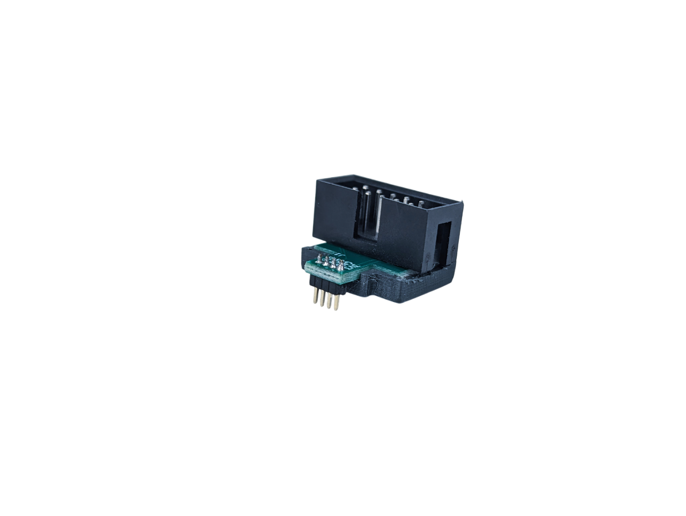
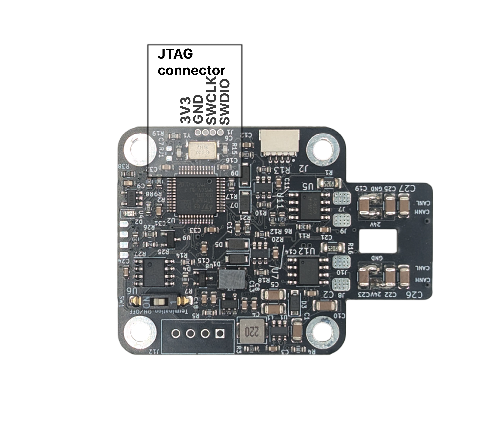
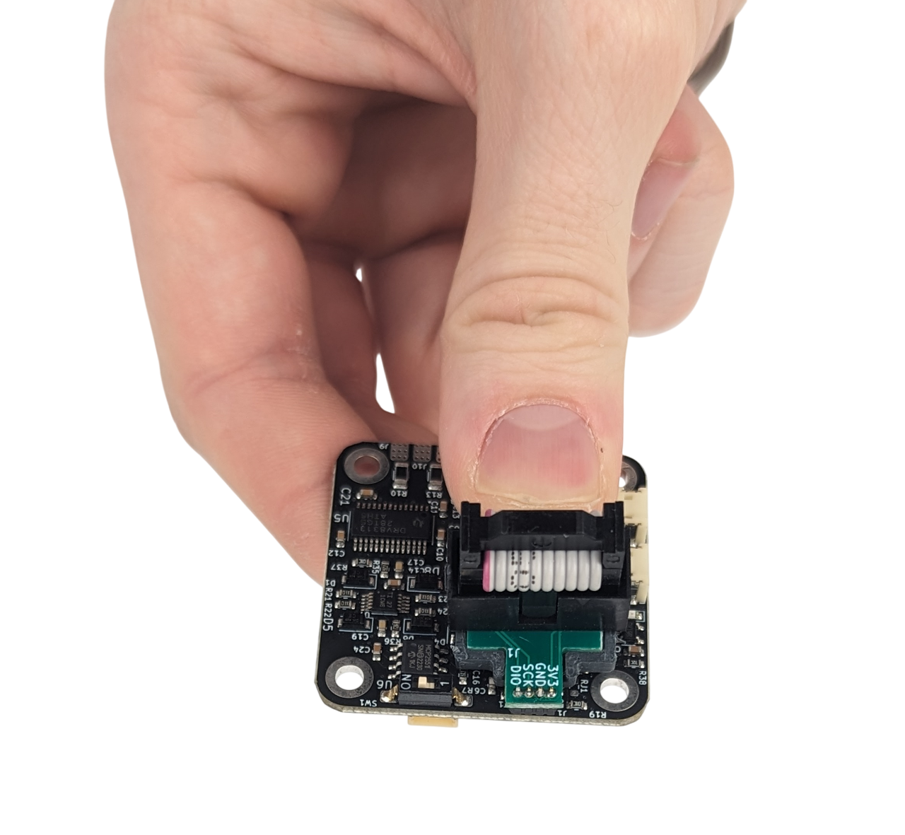
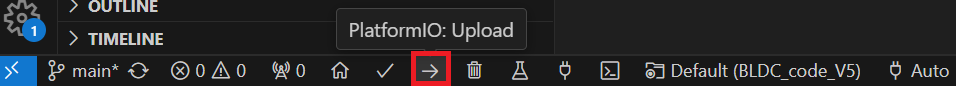
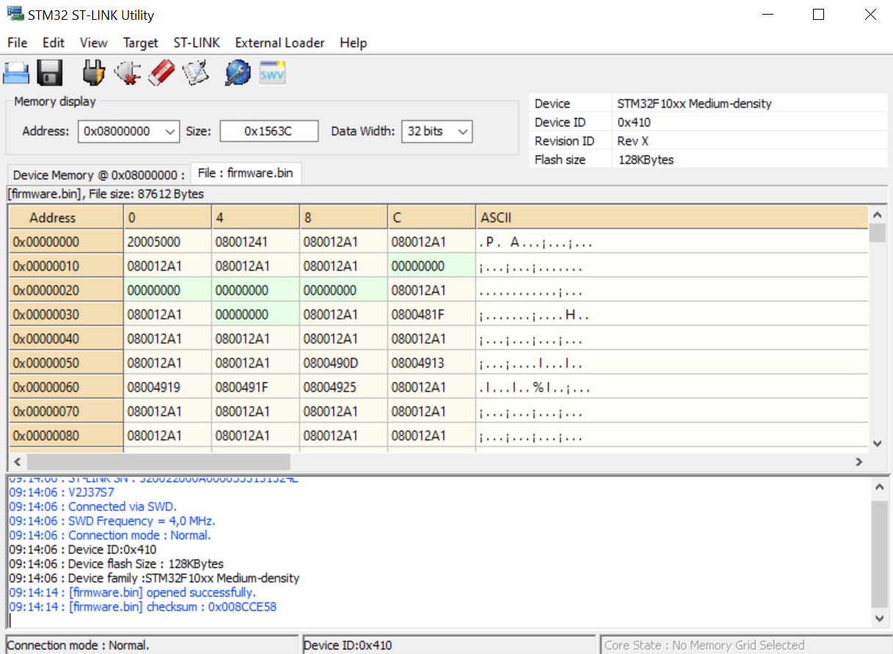
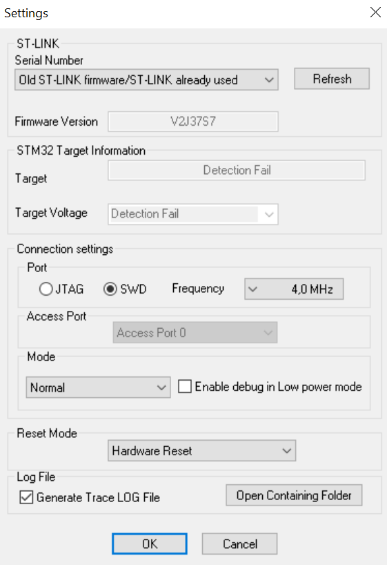
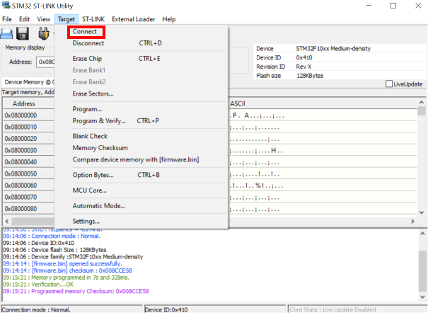
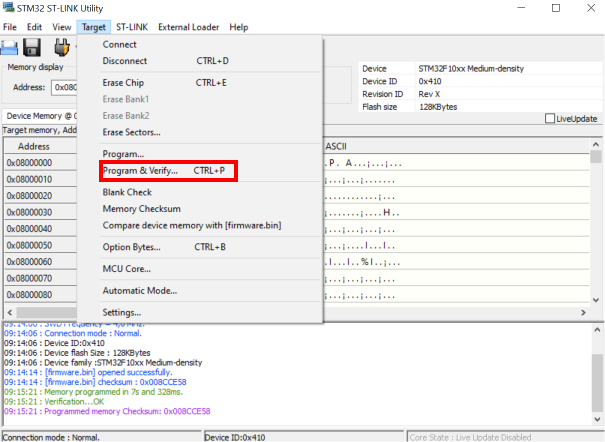

# **Flashing firmware**

!!! Note annotate "You can check what is the latest firmware release in the github page of STEPFOC! To check what software release is on your driver use command **#Info**" 

!!! Tip annotate "Note" 
    This video guide is for **Spectral Micro BLDC** driver but the steps for **STEPFOC** are exactly the same. **You just need to use STEPFOC repository not SPECTRAL MICRO!**
    When flashing new firmware make sure you disconnect power connection and uart connection.

<iframe width="560" height="315" src="https://www.youtube.com/embed/fcvL_6R1Je4?si=I4g3wQzkeJV9rXRw" title="YouTube video player" frameborder="0" allow="accelerometer; autoplay; clipboard-write; encrypted-media; gyroscope; picture-in-picture; web-share" referrerpolicy="strict-origin-when-cross-origin" allowfullscreen></iframe>

   |   |   Needed hardware
    ---- | ---- 
    You can change all variables using UART and CAN so flashing firmware a lot is not necessary  You will usually flash it when:   1. New version of Spectral BLDC firmware is available  2. You are doing custom code developement   3. You are using SimpleFOC firmware | You will need programming adapter from [here!](https://source-robotics.com/products/jtag-programming-adapter-1-27-pitch?variant=47293352903004) 
    

    
!!! Note annotate "" 

## **Connecting to PCB**

=== "Using [Adapter](https://source-robotics.com/products/jtag-programming-adapter-1-27-pitch?variant=47293352903004) "

    Step 1 | Step 2
    ---- | ---- 
    Locate JTAG PINS | Press programming adapter like shown in the picture (apply small amount of pressure on the pins to get a good contact)
    
    
 | 
    
 

!!! Note annotate "" 

## **Flashing using visual studio code**
Download visual studio code: [Link](https://code.visualstudio.com/download) 

1. Open [STEPFOC firmware](https://github.com/PCrnjak/STEPFOC-stepper-controller/tree/main/STEPFOC%20firmware) folder in VS code. (You need to have platformio installed)
2. Press uplaod in VS code (Bottom left corner in VS code)

    

!!! Note annotate "" 

## **Flashing using STM32 ST-LINK Utility**
Download STM32 ST-LINK utility [Link](https://www.st.com/en/development-tools/stsw-link004.html)

!!! Note annotate "HEX and binaries" 
    Using STM32 ST-LINK Utility you can flash only Binary or HEX files. These can be obtained from compiling source code of spectral BLDC firmware

**Open STM32 ST-LINK utility Drag and drop the [binary file](https://github.com/PCrnjak/STEPFOC-stepper-controller/tree/main/Binaries) inside.**

    

**Go to Target/settings and make sure they look like this.**

    

**Go to Target/connect. In case you get a error try to install stlink drivers from [here!](https://www.st.com/en/development-tools/stsw-link009.html)**

    

**Go to Target/program and verify. You should get pink output msg like below.**

    

