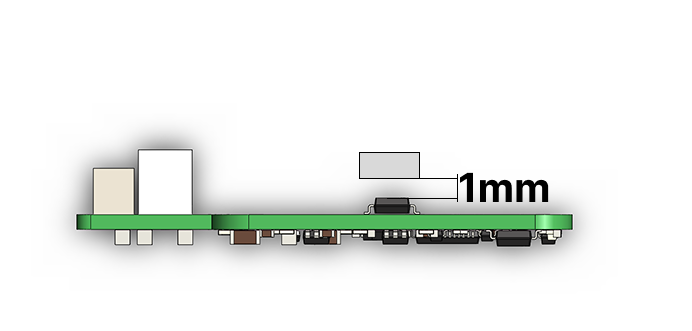
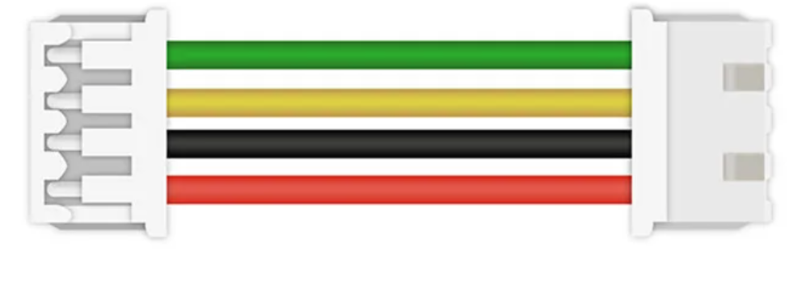
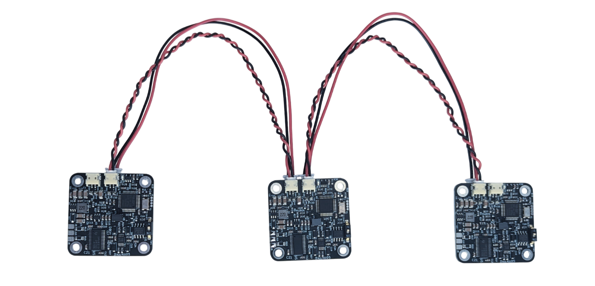
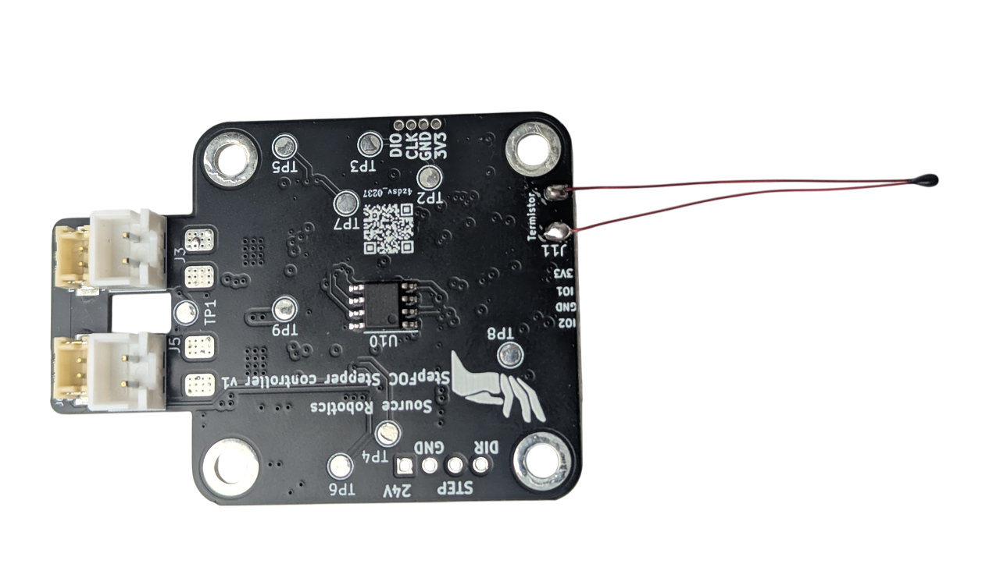
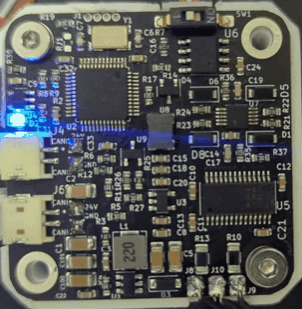

# **Getting started**

## **Spectral Micro BLDC driver** 

You can buy a STEPFOC starter kit here: [Link](https://source-robotics.com/products/spectral-micro-bldc-starter-kit)  
Or buy a single motor driver here: [Link](https://source-robotics.com/products/spectral-micro-bldc-controller)  

## **Recommended hardware**

1. [Diametrically magnetized magnet](https://source-robotics.com/products/6x2-5mm-diametrical-neodymium-magnet)
2. Stepper motor; check [here]() for all tested motors
3. [Programming adapter](https://source-robotics.com/products/jtag-programming-adapter-1-27-pitch)
4. [Serial adapter]()
5. [CAN adapter](https://source-robotics.com/products/canvas-usb-to-can-adapter) 
6. [Termistor](https://source-robotics.com/products/100k-ntc-thermistor)
7. [CAN wires](https://source-robotics.com/products/spectral-micro-can-cable) and [power wires](https://source-robotics.com/products/spectral-micro-power-cable)

!!! Note annotate "" 

## **Hardware setup**

### **Mounting PCB to Motor**

Some hardware considerations:

* Distance between motor encoder and magnet should be around 1 mm.
* Hole spacing of Spectral micro is 31 mm

    

!!! Note annotate "" 

## **Electrical connections**
!!! Danger annotate "REVERSING POLARITIY ON DC+- WILL DESTROY YOUR BOARD." 

    

1. Solder motor phases to **A+, A-, B+, B-** (Note that you may latter need to desolder them to find correct phase order so make sure you dont have too short wires)
2. Connect motor power to one of the **Power connectors** terminals
3. If you are using UART comms. Connect Uart adapter to **UART connector**
4. If you are using termistor, connect it to **Termistor connecor**
5. If you are using CAN comms. Connect CAN adapter to one of **CAN connectors**
6. When uploading code connect JTAG adapter to **JTAG connector**

!!! Danger annotate "**Cable orientation**" 
    **ALL cables used for dasiy chain (CAN and power) need to to follow orientation as shown on the image below! Failing to follow that will destroy your motor controller! All correct cables can be bought here: https://source-robotics.com/pages/connectors-and-cables**  

    
 

!!! Note annotate "" 

## **Connecting multiple motors (daisy chaining)**

Multiple STEPFOC stepper drivers or Spectral BLDC drivers and nodes can be connected to single CAN bus using daisy-chaining. First an last nodes on can bus should have termination resistors. **You can flip the CAN switch to "ON" positon to enable termination resistor.**

!!! Tip annotate "Power connectors can handle max 4 A DC. It is recommended to have at most 6 motor controllers (STEPFOC or Spectral micro) in one daisy chain." 

    
 

!!! Note annotate "" 

## **Thermistor connection**

Solder the termistor like shown in the image. 
!!! Tip annotate "Thermistor is disabled by default. To enable it use command #Term 1" 

    
 

Thermistor needs to be placed on the housing of the stepper motor. Another option is remove one of the 4 stepper screws on the bottom and place thermistor inside that hole. Apply thermal cement on the thermistor to secure it in place and improve termal conductivity. 

 

!!! Note annotate "" 

## **Status**

Normal operation | Calibration | Error mode 
---- | ---- | ----
3 short flashed and a pause 
    
 | Flashing every 0.5 seconds 
    
 | Solid LED, no flashing. 
    

If you have [STEPFOC firmware](https://github.com/PCrnjak/Spectral-Micro-BLDC-controller/tree/main/Spectral%20BLDC%20Firmware) uploaded on your STEPFOC, LEDs will be in one of 3 states.

!!! Note annotate "STEPFOC controllers come **PRELOADED** with STEPFOC firmware" 

* **Normal operation** is when motor controller has no active errors and is calibrated
* **Error mode** is active if any error on the motor driver is active. List of possible errors:
    1. Temperature error
    2. Drv error
    3. Encoder error
    4. Vbus error
    5. Velocity error
    6. Current error
    7. Not calibrated 
    8. Received ESTOP
    9. Watchdog error
* **Calibration** will flash when in calibration routine

!!! Note annotate "" 

## **What next?**

* **Optional** - > Flash the [latest firmware](https://github.com/PCrnjak/Spectral-Micro-BLDC-controller/tree/main/Spectral%20BLDC%20Firmware) to your driver (Note that drivers arrive with preflashed firmware)
* You will need to [calibrate your motor](https://source-robotics.github.io/Spectral-BLDC-docs/apage4_calibration/)
* [Tune your PID loops](https://source-robotics.github.io/Spectral-BLDC-docs/apage5_PID_tuning/)
* Follow one of the guides or examples to start using Spectral driver

!!! Note annotate "" 
