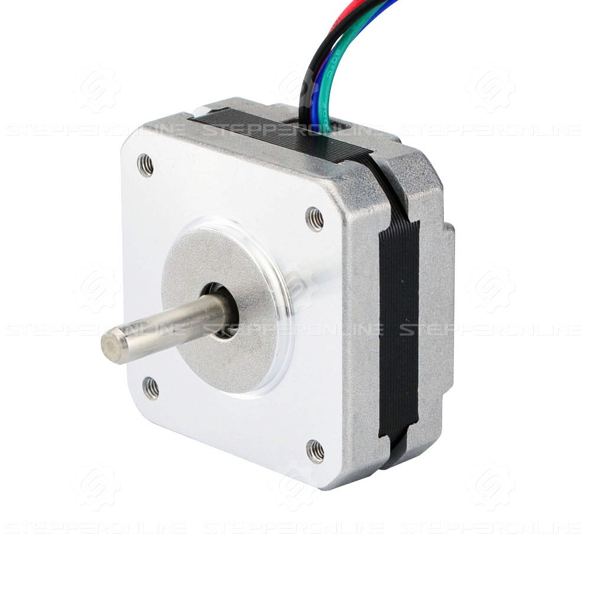
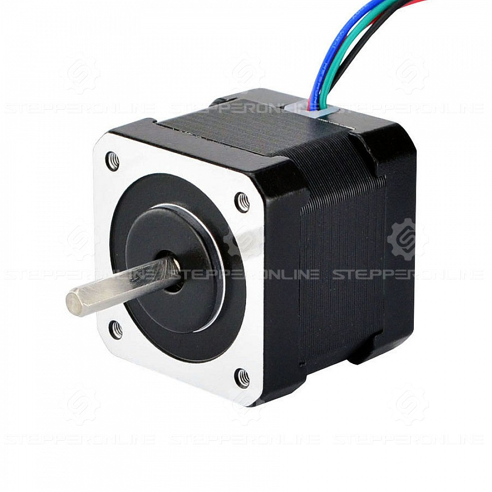
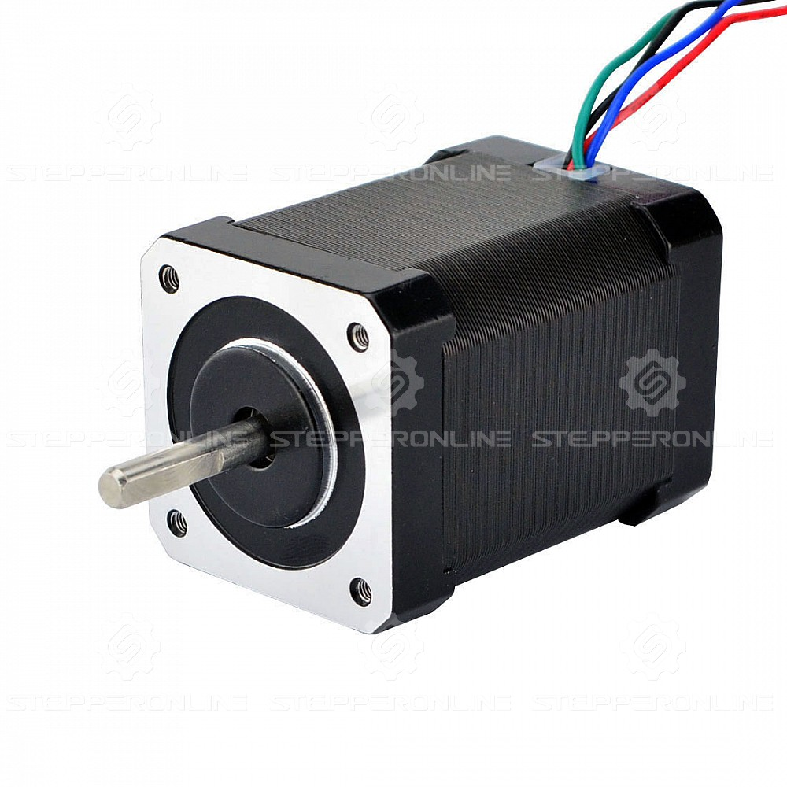
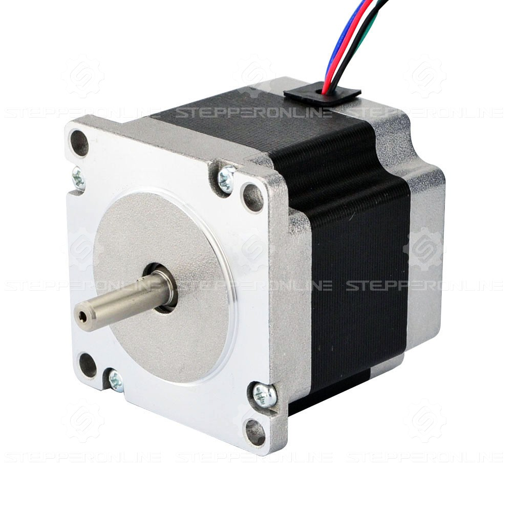

# Tested motors

!!! Tip annotate "Tip" 
    Look for the motors that have have resistance from 1 - 5 ohms and max current rating of 3A.

## **Tested motors**
Motor | Name | Specifications | Link  
---- | ---- | ---- | ---- 
.
    
 |17HS08-1004S| Pole pairs: 50   Weight: 140 g    Phase to phase Resistance: 3.7 ohm    Inductance: 4.5mH | [Link](https://www.omc-stepperonline.com/nema-17-bipolar-1-8deg-16ncm-22-6oz-in-1a-3-7v-42x42x20mm-4-wires-17hs08-1004s?tracking=6543849d6ff69)
.
    
 |17HS16-2004S1|Pole pairs: 50   Weight: 310 g    Phase to phase Resistance: 1.1 ohm   Inductance: 2.6mH|[Link](https://www.omc-stepperonline.com/nema-17-bipolar-45ncm-64oz-in-2a-42x42x40mm-4-wires-w-1m-cable-connector-17hs16-2004s1?tracking=6543849d6ff69)
.
    
 |17HS24-2104S|Pole pairs: 50   Weight: 500 g    Phase to phase Resistance: 1.6 ohm   Inductance: 3mH| [Link](https://www.omc-stepperonline.com/nema-17-bipolar-1-8deg-65ncm-92oz-in-2-1a-3-36v-42x42x60mm-4-wires-17hs24-2104s?tracking=6543849d6ff69)
.
    
 |23HM22-2804S|Pole pairs: 100   Weight: 700 g    Phase to phase Resistance: 1.16 ohm   Inductance: 4.2mH|[Link](https://www.omc-stepperonline.com/nema-23-bipolar-0-9deg-1-26nm-178-4oz-in-2-8a-2-5v-57x57x56mm-4-wires-23hm22-2804s?tracking=6543849d6ff69)

